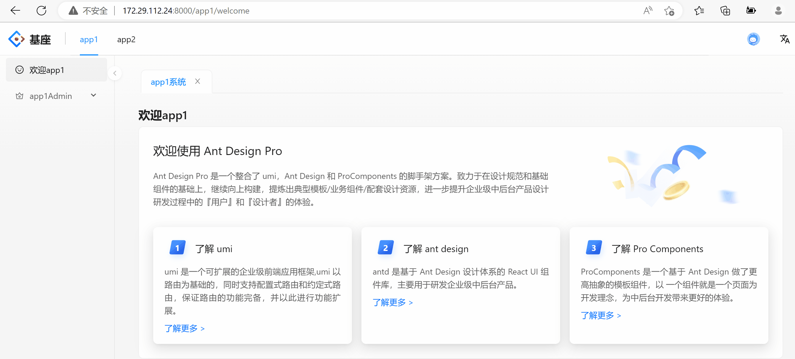

# 多Tabs 在乾坤中的应用

此 demo 是为了 **[xiaohuoni](https://github.com/xiaohuoni)** 

问题 issues：[多 tabs 未来是否支持微前端吗？](https://github.com/alitajs/alita/issues/496)

ant-design-pro 的 keep-alive 方案如何在乾坤中应用。目前遇到的情况是基座中引入 keep-alive ，拿的 tabs 名是子应用的名，而不是子应用下真正路由的名字

如下图所示：

